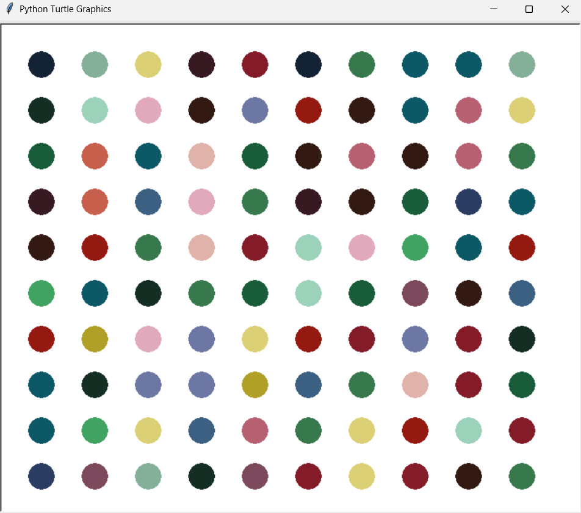

# 🎨 Hirst-Inspired Dot Painting


A generative 10 × 10 dot painting created with Python Turtle. Every execution produces a different color composition.

---

## 📸 Preview



## 🖼️ About the project

The program creates a grid of 100 colored dots inspired by Damien Hirst's spot paintings.

The original RGB palette was extracted from a reference image using `colorgram.py`. The selected colors are now stored directly in the program, so no external packages or source images are required to run it.

## ⚙️ How it works

* The turtle begins in the bottom-left corner.
* Two nested loops create ten rows with ten dots each.
* Each dot receives a randomly selected RGB color.
* The turtle moves to the next row after completing each line.
* A new composition is generated every time the program runs.

## 🧠 Concepts practiced

* Turtle graphics
* RGB color tuples
* Nested loops
* Random selection
* Coordinates and positioning
* Working with an extracted color palette

## 🚀 Run the project

```bash
python main.py
```

Python's `turtle` and `random` modules are included with Python, so no additional dependencies are required.

## 📁 Project structure

```text
13-Hirst-Painting/
├── main.py
├── preview.png
└── README.md
```

## 📝 Note

This project was created for educational purposes while learning Python graphics and color manipulation.
